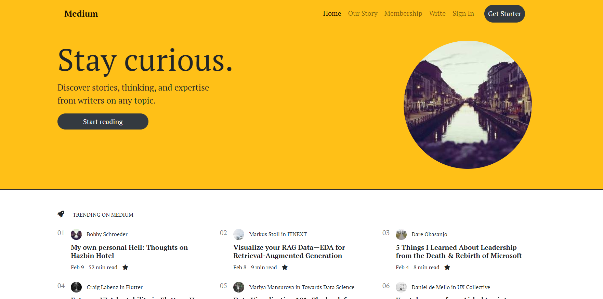

# Medium

[Demo](https://ummahanakcanmedium.netlify.app/)

## Project Overview
- In this project, I have engineered a Medium-inspired application leveraging Bootstrap for achieving responsive design, while ensuring semantic structuring of HTML and implementing dynamic page interactions through JavaScript.

- You may refer to the following sources for further information.
  
   [Bootstrap](https://getbootstrap.com/)

   [Bootstrap Templates & Themes](https://startbootstrap.com/themes)

   [Bootstrap 4 Cheat Sheet](https://hackerthemes.com/bootstrap-cheatsheet/)
  

